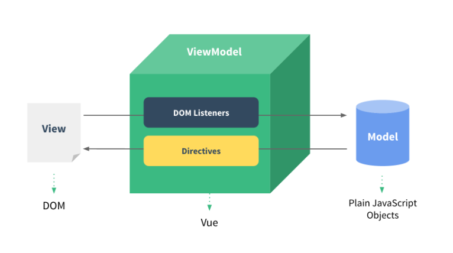

# vue官网链接
https://cn.vuejs.org/

https://github.com/vuejs

# MVVM模型

vm 的操作是将DOM的操作封装起来，开发人员不用关心DOM的操作，只要Model数据改变View数据同时跟着改变, 减少了大量的代码操作。



# 简单code
* 标签体的绑定可以使用插值表达式；

* 标签属性值则使用v-bind（单向数据渲染）；data数据池影响view
* v-model（双向数据渲染）；相互影响
* 事件绑定@click 或者 v-on:click="showInfor1"等不需要括弧

```
<!DOCTYPE html>
<html lang="en" xmlns:v-bind="http://www.w3.org/1999/xhtml" xmlns:v-model="http://www.w3.org/1999/xhtml"
      xmlns:v-onclick="http://www.w3.org/1999/xhtml" xmlns:v-on="http://www.w3.org/1999/xhtml" xmlns: xmlns: xmlns:>
<head>
    <meta charset="UTF-8">
    <title>MVVM</title>
</head>
<body>

<div id="app">

    <!-- 标签体的绑定可以使用插值表达式-->
    <h1>{{name}}</h1>
    <h1>{{age}}</h1>

   <!-- 标签属性值则使用v-bind（单向数据）-->
    
    
    <br/>
  <!-- v-model(双向绑定)-->
   <input type="text" v-model:value="coder.language1"><br/>
    <input type="text" v-bind:value="coder.language1"><br/>
    您所學習的編程語言是{{coder.language1}}
    <br/>
    <!-- v-model(双向绑定)作业-->
    <input type="text" v-model:value="img.one_img"><br/>
    <input type="text" v-bind:value="img.one_img"><br/>
    img is {{img.one_img}}<br/>
    

    <br/>

    <button v-on:click="showInfor1">点击 +1</button>
    <button @click="number += 2">点击 +2</button>
    <input type="text" v-bind:value="number">

    <br>
    <input type="text" v-model:value="bookName">
    <button @click="showBookName">bookName</button>

</div>

<script src="vue.js"></script>
<script>

    let vm = new Vue({
        el:"#app",  // 将vue的实例与div中id=app的区域关联

        //  model 数据池
        data:{
            name: "CoderLeiChao",
            age : 18,
            number:0,
            bookName:"圣经",

            img_name :"leichao.jpg",
            img_width: "500px",
            img_height: "300px",

            coder:{
                language1:"Vue",
                language2:"Java",
            },
            img:{
                one_img:" ",
            }
        },

        methods:{

            showInfor1(){
               this.number=this.number+1;
            },
            showBookName(){
                alert(this.bookName);
            }

        }

    });
    console.log(vm)
</script>

</body>
</html>
```
* 网页局部提交数据，比如购物车或者其他信息的验证，需要通过ajax或者框架提供的函数。
* 修饰符

```
<!DOCTYPE html>
<html lang="en" xmlns:v-bind="http://www.w3.org/1999/xhtml" xmlns:v-model="http://www.w3.org/1999/xhtml"
      xmlns:v-on="http://www.w3.org/1999/xhtml">
<head>
    <meta charset="UTF-8">
    <title>MVVM</title>
</head>
<body>

<form action="http://www.google.com"  v-on:submit.prevent="checkInfor" >
<div id="app" >
 <br>
  <input type="text"   v-model.trim="information.name">
  <br>
  lazy
  <input type="text" v-model.lazy="information.name">
  <p> lazy: {{information.name}}</p>
  <br>
  <br>
  lazy
  <input type="text" v-model.number="information.name">
  <p> lazy: {{information.name}}</p>
  <br>
  onblur
  <input type="text"   @blur="changeBlure">
  <br>
  {{information.name}}
  <br>
  <input type="text"   v-model:value="information.name"  v-on:keyup.down="checkInfor">

<br>

 <input type="checkbox" v-model="checked">以上信息是否同意【if】
 <h1 v-if="checked">同意条款</h1>
 <h1 v-else="checked">不同意条款</h1>

 <input type="checkbox" v-model="checked">以上信息是否同意【show】
 <h1 v-show="checked">同意条款</h1>
 <h1 v-show="!checked">不同意条款</h1>

 <br>
 <h3>请输入您的分数</h3>
 <input type="text" v-model="score">
 <span v-if="score>=90">优秀</span>
 <span v-else-if="score>=80">良好</span>
 <span v-else-if="score>=70">中</span>
 <span v-else-if="score>0">差</span>
 <h1>测试</h1>

<ul>

 <li v-for="item in arrayInfor" :key="item.name">
  {{item.name}}
 </li>

<hr>
 <li v-for="(value,item,index ) in ObjectInfor" >
  {{item}}---->{{value}}----->{{index}}
 </li>
</ul>
 
 <hr>
<table align="center" width=“500px" border="1px">

  <tr v-if="item.age>23" v-for="(item,index) in Person">

    <td>{{item.id}}</td>
    <td>{{item.age}}</td>
    <td>{{item.name}}</td>
   <td>{{index}}</td>
  </tr>
</table>
 
</div>
 
</form>

<script src="vue.js"></script>
<script>
  let vm = new Vue({
    el:"#app",

    data:{
      information: {
      },
     checked:false,
     score:"",
     arrayInfor: [
      {name:"zhangsan"},
      {name:"lisi"},
      {name:"wangwu"}
     ],
     Person:[
      {id:1,age:22,name:"lei1"},
      {id:2,age:23,name:"lei2"},
      {id:3,age:35,name:"lei3"},
     ],

     ObjectInfor:{
       name:"Object",
      age:18,
      gender:"男"
     }


    },

    methods:{
      checkInfor(){
        if(this.information.name){
          console.log("您输入的信息是"+this.information.name)
        }else{
          console.log("您输入的信息为空")
        }

      },
      changeBlure(){
        console.log("changeBlure")
      }
    }
  });
  console.log(vm)
</script>


<!--async-->
<!--prop-->
</body>
</html>
```
* v-show隐藏则是为该元素添加css (display:none)，dom元素依旧还在。 
* v-if显示隐藏是将dom元素整个添加或删除（将dom注释掉）。
* v-for 可以遍历数组和对象 (v-if和v-for可以组合使用)
#  组件
* 全局组件适合所有的Vue对象中
* 局部适合于挂载的div范围中，那个vue对象引入那个vue才可以有效使用
* 组件也是一个new实例，在页面和业务逻辑方面都可以复用
* 组件定义需要放置在new Vue()之前，负责组件注册失败。
* 组件渲染需要html的template,组件中的data是一个函数，不在是以前的数据池

```
<!DOCTYPE html>
<html lang="en" xmlns:v-bind="http://www.w3.org/1999/xhtml" xmlns:v-model="http://www.w3.org/1999/xhtml"
      xmlns:v-on="http://www.w3.org/1999/xhtml">
<head>
  <meta charset="UTF-8">
  <title>MVVM</title>
</head>
<body>


  <div id="app" >

    <h1>组件问题引出</h1>

    <button  v-on:click="add()">点击次数为{{count}}</button>

    <button  v-on:click="add1()">点击次数为{{count1}}</button>

    <h1>组件2 全局组件</h1>

    <datainfor> </datainfor>
    <datainfor> </datainfor>


    <h1>组件3 局部组件</h1>

    <localcom> </localcom>
    <localcom> </localcom>

  </div>
  <hr>

  <div id="app1">
    <h1>测试全局</h1>
    <datainfor> </datainfor>
    <datainfor> </datainfor>

  </div>


<script src="vue.js"></script>
<script>


  const localcom={
    template:' <button  v-on:click="addComponent1()">点击次数为{{countComponent1}}</button>',
    data(){
      return {
        countComponent1:10,
      }
    },
    methods:{
      addComponent1(){
        this.countComponent1++;
      }
    }
  }

    Vue.component("datainfor",{
    template:' <button  v-on:click="addComponent()">点击次数为{{countComponent}}</button>',
    data(){
      return {
        countComponent:10,
      }
    },
    methods:{
      addComponent(){
       this.countComponent++;
      }
    }
  });


  let vm = new Vue({
    el:"#app",
    data:{
      count:10,
      count1:10,
    },

    methods:{
      add(){
        this.count++;
      },
      add1(){
        this.count1++;
      }
    },
    components:{
      "localcom":localcom,
    }
  });


  let vm1 = new Vue({
    el:"#app1",
    components:{
      "localcom":localcom,
    }
  })
  console.log(vm)
</script>

</body>
</html>
```
#  Vue生命周期

#  Vue脚手架
* https://cli.vuejs.org/zh/
* 安装node
* 启动一个项目 vue init webpack vue_project


