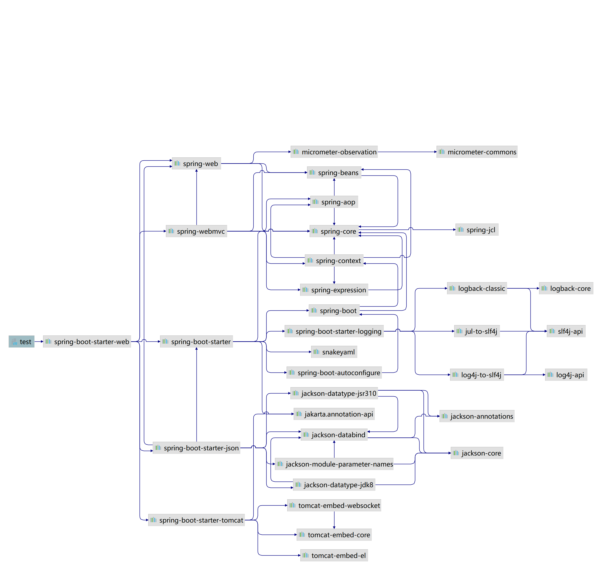
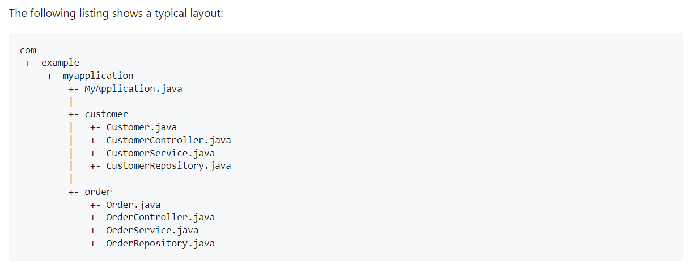
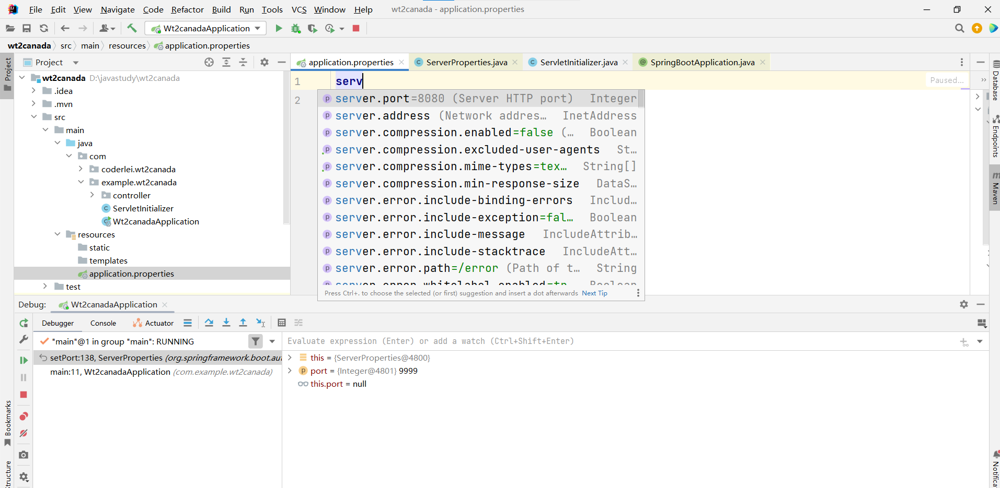
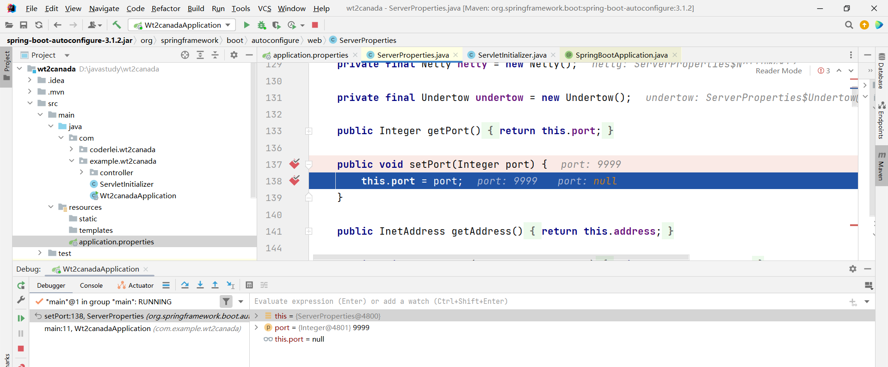

# 1 SpringBoot基本概念

 Spring Boot是一个基于Spring的开源框架，为了简化开发，它可以帮我们快速整合许多框架（SSM SSH），简化了maven项目的pom.xml配置， 避免将时间花费在手动配置文件上。

比如在pom.xml中引入spring-boot-starter-web,则会引入许多相关web开发的依赖包。

注：版本仲裁，依赖包的版本采用就近原则，若项目中的配置文件没有写项目版本则会采用父类依赖的版本。

```
<dependency>
            <groupId>org.springframework.boot</groupId>
            <artifactId>spring-boot-starter-web</artifactId>
 </dependency>
```

解释：
spring-boot-starter-web

* https://docs.spring.io/spring-boot/docs/current/reference/html/using.html#using.structuring-your-code

> Starter for building web, including RESTful, applications using Spring MVC. Uses Tomcat as the default embedded container





# 2 springboot,spring,springmvc 的关系
springboot包含spring,spring 包含springmvc。
* springmvc是spring的web层处理的一个组件。
* spring是包含IOC和AOP，IOC提供依赖注入容器，AOP解决面向切面。
* spring家族衍生了许多框架Spring Data,Spring Cloud,Spring Security，但是都是基于spring。

# 3 查看容器中注入的组件


```
    public static void main(String[] args) {
        ConfigurableApplicationContext ioc = SpringApplication.run(TestApplication.class, args);
        String[] beanDefinitionNames = ioc.getBeanDefinitionNames();
        for (String beanNames:beanDefinitionNames) {
            System.out.println("beanNames-->"+beanNames);
        }
    }
```

# 4 默认自动配置
* application.properties 配置文件

We generally recommend that you locate your main application class in a root package above other classes. The @SpringBootApplication annotation is often placed on your main class, and it implicitly defines a base “search package” for certain items. For example, if you are writing a JPA application, the package of the @SpringBootApplication annotated class is used to search for @Entity items. Using a root package also allows component scan to apply only on your project.



* 修改自动配置,扫描指定的路径

@SpringBootApplication(scanBasePackages = {"com.franklei.xxx","xxx.xxx.xxx"})

*  约定优于配置
为了方便程序员开发，许多约定俗成的规定框架已经在启动的时候配置好了，若有其他特殊需求，程序员可以手动在配置文件中修改。配置文件的内容不需要全部记忆，可以关键词搜索，比如port，mail 等，默认的配置会映射到特定的类。
* 默认的port是8080

* 但是有特殊需求可以修改，配置映射的类也会同步修改，比如将8080修改为9999
@ConfigurationProperties中的ServerProperties类的属性将发生变化。


* xxxproperties和xxxAutoconfigure 关联配置加载


